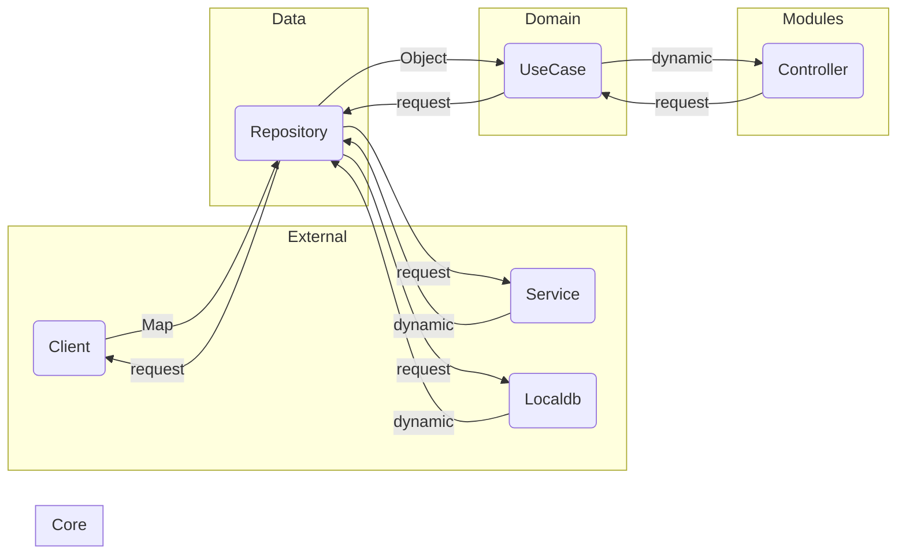

Sobre o que se trata o projeto: [README](README.md)
# ARQUITETURA
## Framework
O projeto utiliza o [](https://docs.flutter.dev/) como framework principal.
## Camadas
A estrutura de pastas do projeto deve ser organizado por camadas que correspondam à seguinte divisão de responsabilidades:

### Core
Componentes centrais do código, compartilhados entre os módulos:
- **errors:** interface de erro `AppError` da qual devem descender todos os subtipos erro tratados na aplicação;
- **routes:** classes para definição e gerenciamento de rotas;
- **theme:** classes para gerenciamento de temas e componentes de UI;
- **utils:** elementos de valor constante, enums, extensões e classe para centralizar validadores de formulários;
- **widgets:** todos os widgets componentizados e/ou personalizados que sejam utilizados por mais de um [module](#modules).

### Data
Camada responsável pelo processamento de dados: a transcrição de dados brutos em objetos modelados e vice-versa.
- **errors:** classes de erros relativos ao gerenciamento de dados;
- **mappings:** extensões para classes [model](#domain) que fornecem métodos `fromMap` e `toMap` para a conversão de dados e funcionalidades adicionais;
- **repositories:** classes que implementam as interfaces das quais dependem os [usecases](#domain);
- **sources:** interfaces de recursos externos que serão implementadas na camada [external](#external).

### Domain
Domínio da aplicação, onde se encontram as abstrações de todos os cenários reais que a mesma abrange:
- **errors:** classes de erros disfuncionais, relativos a problemas de lógica interna às regras de negócios;
- **interfaces:** interfaces responsáveis pelo gerenciamento dos dados emitidos pelo domínio;
- **models:** classes que representam entidades de dados reais modelados para uso na aplicação;
- **usecases:** classes que implementam as regras de negócio específicas de cada caso de uso.

### External
Todos os recursos de persistência externos à aplicação:
- **localdb:** classes que implementam requisições de banco de dados em cache local;
- **clients:** classes que implementam requisições de API e bancos em nuvem;
- **errors:** classes de erros relacionados a estado de conexão ou falhas de requisição (ex.: caminhos não existentes);
- **services:** implementadores de requisições de dados simples em persistência local.

### Modules
Funcionalidades (módulos) da aplicação, onde individualmente se encontram:
- **components:** componentes visuais utilizados apenas pelo módulo referido;
- **views:** subpáginas do módulo referido (layouts construídos em estado de sucesso e/ou blocos de navegação internos ao módulo);
- ***example*_controller.dart:** cubits ([package: bloc](#gerenciamento-de-estados)) que realizam o gerenciamento de estados do módulo e a chamada dos [usecases](#domain);
- ***example*_page.dart:** página principal do módulo, para onde se refere a raiz da navegação do módulo referido e onde acontece o gerenciamento de estados;
- ***example*_states.dart:** estados gerenciados pelo controller;
- ***example*_module.dart:** subclasse de Module ([package: flutter_modular](#injeção-de-dependências)) onde é feita a injeção de dependências e o gerenciamento de sub-rotas.
## Nomenclaturas
A definição dos nomes de todas as variáveis, classes, arquivos e diretórios do projeto devem respeitar as [regras do linter do Dart](https://dart.dev/tools/linter-rules) e as seguintes determinações:
### Regra geral
**Todos os nomes devem exprimir exatamente a ideia do que representam.**

As nomenclaturas devem ser feitas em inglês, exceto para falsas cognatas ou em casos em que incorra em grave risco de ambiguidade do termo.

### Diretórios
1. A inserção de novos subdiretórios deve ser feita **exclusivamente** na camada [modules](#modules) ou com aprovação unânime do grupo de desenvolvedores da aplicação.
1. Os módulos devem ser nomeados da forma mais simples possível que exprima o ponto central da funcionalidade. (ex.: auth, home, sync)
```
// code smell
.
└── lib/
    ├── core/
    │   └── products/
    ├── ...
    ├── ...
    ├── ...
    └── modules/
        ├── auth/
        └── home/

// good code
.
└── lib/
    ├── core/
    ├── ...
    ├── ...
    ├── ...
    └── modules/
        ├── auth/
        ├── home/
        └── products/
```

### Arquivos
1. Os arquivos devem possuir o mesmo nome da classe que contém, com a única diferença de serem escritos em snake case. Exemplo:
```dart
// arquivo: product_repository_interface.dart

class ProductRepositoryInterface { ... }
```
2. Nos casos em que os arquivos contenham mais de uma classe (exceto para [StatefulWidgets](https://api.flutter.dev/flutter/widgets/StatefulWidget-class.html)) ou enums, o nome do arquivo deve ser apenas colocado no plural sem outras modificações. Exemplo:
```dart
// arquivo: home_states.dart

sealed class HomeState {}

class LoadingHomeState extends HomeState { ... }
class SuccessHomeState extends HomeState { ... }
class ErrorHomeState extends HomeState { ... }
```
```dart
// arquivo: pay_methods.dart

enum PayMethod { ... }
```
3. Os arquivos de [`extensions`](#core) devem ser nomeados com o **nome da classe que está sendo estendida** + *underline* + **nome da extension**. Exemplo:
```dart
// arquivo: buildcontext_size.dart

extension Size on BuildContext { ... }
```
4. Os arquivos de exportação devem ser criados por responsabilidade do tipo referido. Devem ser nomeados com o seguinte formato: **_export.dart*. Exemplo:
```dart
// arquivo: modules_export.dart

export 'auth/auth_module.dart';
export 'home/home_module.dart';
export 'sync/sync_module.dart';
...
```

### Classes
1. Todas as classes devem ser nomeadas com substantivos que descrevam o que a classe representa.
1. **Não é permitido** o uso de prefixos ou sufixos de nenhuma natureza ao nomear [models](#domain).
1. As extensões de widgets devem receber **por sufixo** o widget que têm por base.
1. As classes que representam estados devem receber **por prefixo** o estado que representam.
1. As demais classes devem receber **por sufixo** apenas com a denominação que representa sua responsabilidade seguida, se for o caso, do sufixo `Interface`.

Exemplos:
```dart
// models
class User {}

// usecases
class AuthCase {}

// controllers
class HomeController extends Cubit<HomeState> {}

// modules
class HomeModule extends Module {}

// pages
class HomePage extends StatelessWidget {}

// states
class SuccessHomeState extends HomeState {}

// components
class PricingDialog extends Dialog {}
class CurrencyFormField extends TextFormField {}

// views
class HomeView extends StatelessWidget {}

// interfaces
abstract interface class ClientInterface {}

// errors
class ExternalError extends AppError {}
```

### Métodos (funções)
1. Todos os métodos devem ser nomeados com verbos ou expressões verbais que descrevam exatamente o que executam.
```dart
const pi = 3.14;

double calculateCircleArea(double radius) => pi * radius * radius;

double calculateCirclePerimeter(double radius) => 2 * pi * radius;
```
2. Devem ser evitadas descrições redundantes e implícitas pelo escopo em que o método se encontra.
```dart
// Por pertencerem à classe Circle, é necessariamente implícito que os métodos retornem
// valores de área e perímetro referentes àquela classe.

class Circle extends Shape {
    double get calculateArea => ...
    double get calculatePerimeter => ...
}
```
3. Nenhum método pode executar ações que não sejam intrínsecas ao que descreve sua nomenclatura. Se um determinado comportamento previsto interliga mais de uma ação, ambas devem ser encapsuladas.
```dart
//code smell
void void stockProduct(int qtd, double price) {
    addCashOnCashDesk(qtd * price);
    decreaseProductFromStock(qtd);
}

// good code
void sellProduct(int qtd, double price) {
    addCashOnCashDesk(qtd * price);
    decreaseProductFromStock(qtd);
}
```
4. Todos os métodos de uso exclusivamente interno de uma classe devem ser declarados privados, exceto se a própria classe for privada (ex.: subclasses de estado de [StatefulWidgets](https://api.flutter.dev/flutter/widgets/StatefulWidget-class.html)).
```dart
class Dog {
    void showJoy() {
        _bark();
        _jump();
        _lick();
    }

    void _bark() { ... }
    void _jump() { ... }
    void _lick() { ... }
}
```
5. Getters podem ser utilizados apenas para substituir métodos que:
   - não utilizam nenhuma variável externa à classe
   - não enviam informações para outras camadas
```dart
// code smell
class Circle {
    final double radius;

    double get calculateArea => return _repository.saveShapeArea(radius);
}

// good code
class Circle {
    final double radius;

    double get calculateArea => 3.14 * radius * radius;

    void saveArea() {
        _repository.saveShapeArea(radius);
    }
}
```

### Variáveis
1. Todas as variáveis devem ser nomeadas com substantivos que descrevam o que representam dentro do escopo a que pertencem.
1. Abreviações somente são permitidas em casos de amplo reconhecimento, de forma que não atrapalhem a legibilidade do código. (ex.: num, info, tel, max, min...)
1. Apenas métodos construtores poderão possuir mais de um parâmetro posicional, e utilizados apenas para injeção de dependências.
1. Devem ser aplicadas as mesmas regras referentes aos [métodos](#métodos) a partir do item **2**.
## Tratamento de erros
Todas as possíveis exceções da aplicação devem ser tratadas o mais especificamente possível, de forma que seja fornecido ao usuário (ou ao sistema) um feedback útil e compreensível.
### Erros por camada
Cada camada deve lidar apenas com as exceções pertinentes à sua responsabilidade.

Cada camada deve possuir uma interface de erro própria, que deve descender de [`AppError`](#core) e ser implementada pelas classes de erros específicos.

Além dos erros esperados, cada camada deve encapsular exceções genéricas e um erro prefixado por `Unespecified`.
```dart
// arquivos no diretório 'errors'
abstract interface class ExternalError implements AppError {}

class DioConnectionError implements ExternalError { ... }

class UnespecifiedExternalError implements ExternalError { ... }

// arquivo dio_client.dart
class DioClient implements ClientInterface {
    @override
    Future<Map<String, dynamic>> create({
        required String endpoint,
        required Map<String, dynamic> data,
    }) async {
        try {
            final response = await dio.post(endpoint, data: data);
            return response.data;
        } on DioException catch (e) {
            throw DioConnectionError(e);
        } catch (e) {
            throw UnespecifiedExternalError(e);
        }
    }
}
```
Caso ocorra uma exceção em alguma camada anterior a ela, deve utilizar o `rethrow` para que o erro seja propagado e tratado de forma apropriada.
```dart
Future<Session> signIn(String email, String password) async {
    try {
        final data = {'email': email, 'password': password};
        final result = await _client.create(endpoint: 'auth', data: data);
        try {
            return Session.fromMap(result);
        }
        catch (e) {
            throw InvalidFormatError(e);
        }
    } catch (e) {
        rethrow;
    }
}
```
## Testes unitários
A inclusão de testes unitários no código é considerada uma prática padrão, pois eles ajudam a identificar problemas precocemente, facilitam refatorações e melhoram o código, são essenciais para garantir a qualidade e a robustez do seu código. Eles permitem que você verifique o comportamento de partes individuais do código isoladamente, garantindo que cada função ou método funcione conforme esperado.

**Todos os [usecases](#domain) devem ter 100% de cobertura de testes.**

Os testes unitários devem ser escritos seguindo os seguintes passos:
1. Isolar a unidade que está sendo testada;
1. Preparar os dados ou configurações necessárias para o teste;
1. Executar a unidade de teste e verificar se o resultado obtido corresponde ao resultado esperado.

Exemplo:
```dart
import 'package:test/test.dart';

class Calculator {
  double add(double a, double b) {
    return a + b;
  }
}

void main() {
  Calculator calculator;

  // Preparar o ambiente de teste antes de cada teste
  setUp(() {
    calculator = Calculator();
  });

  // Teste para o método add
  test('Calculator.add should return 4 when adding 2 and 3', () {
    var result = calculator.add(2, 3);
    expect(result, 5);
  });
}
```
## Branchs
A criação de novas branches, tal como a sua nomenclatura, deve ser feita exclusivamente pela geração automática do GitHub através das issues.
### Main
- **Não é permitido** realizar nenhum commit diretamente na branch main.
- **Não é permitido** realizar pull requests sem que a branch de origem esteja desatualizada em relação à branch main.
- **Não é permitido** realizar pull requests com arquivos que gerem conflitos perante o merge automático.
### Branchs auxiliares
Além das branchs associadas às issues do projeto, estão presentes no repositório branchs auxiliares que devem ser utilizadas apenas para os seguintes respectivos propósitos:
- **architecture:** refatorações concernentes a adequações à presente arquitetura;
- **bugs:** correções de problemas ínfimos de execução que tenham passado desapercebidos em um merge e cuja dimensão dispense a criação de uma issue;
- **docs:** documentações de qualquer trecho do código e alterações em arquivos Markdown;
- **layout:** alterações pequenas de apresentação que não afetem a execução da aplicação e cuja dimensão dispense a criação de uma issue;
- **tests:** alterações em arquivos de teste.
## Commits
Os commits devem ser simples, de forma a não abranger muitos [tipos](#padrão-de-tipos-de-commit). A mensagem do commit deve ser sucinta, clara, consistente com o seu [tipo](#padrão-de-tipos-de-commit) e em inglês.
### Padrão de tipos de commit
|**Palavra-chave**|**Intenção do commit**|**Exemplos**|
|:-:|:-:|:-:|
|**build**|mudanças que afetam o processo de build do projeto ou dependências externas|Gulp, adicionar/remover dependências do npm|
|**chore**|mudanças no projeto que não afetem o sistema ou arquivos de testes. São mudanças de desenvolvimento|Mudar regras do eslint, adicionar prettier, adicionar mais extensões de arquivos ao .gitignore|
|**ci**|mudanças nos arquivos de configuração de CI|Circle, Travis, BrowserStack, etc|
|**docs**|mudanças na documentação do projeto|Adicionar informações na documentação da API, mudar o README, etc|
|**feat**|desenvolvimento de uma nova feature ao projeto|Acréscimo de um serviço, funcionalidade, endpoint, etc
|**fix**|utilizado quando há correção de erros que estão gerando bugs no sistema|Aplicar tratativa para uma função que não está tendo o comportamento esperado e retornando erro|
|**perf**|uma alteração que melhorou a performance do sistema||
|**refactor**|refatoração de código que não tenha qualquer tipo de impacto na lógica/regras de negócio do sistema|Mudanças de código após um code review|
|**revert**|reversão de um commit anterior||
|**style**|mudanças de formatação e estilo do código que não alteram o sistema de nenhuma forma|Mudar o style-guide, mudar de convenção lint, arrumar indentações, remover espaços em brancos, remover comentários, etc|
|**test**|criação ou alteração de códigos de teste|Criação de testes unitários|
## Packages
### Injeção de dependências
O sistema de injeção de dependências da aplicação é feito através do 
[flutter_modular](https://pub.dev/packages/flutter_modular).
### Gerenciamento de estados
O projeto utiliza o [Bloc](https://pub.dev/documentation/bloc/latest/) em conjunto com Cubit como padrão para o gerenciamento de estados. Todas as classes de controller devem descender da classe `Cubit`. [Documentação do padrão](https://bloclibrary.dev/#/gettingstarted)

Para a escuta dos estados em tela, devem ser utilizados os widgets próprios do pacote [flutter_bloc](https://pub.dev/packages/flutter_bloc).

Obs.: para gerenciar reatividades simples que não passam por outras camadas, pode-se utilizar um [ValueNotifier](https://api.flutter.dev/flutter/foundation/ValueNotifier-class.html) com o respectivo
[ValueListenableBuilder](https://api.flutter.dev/flutter/widgets/ValueListenableBuilder-class.html).
### Gerenciamento de rotas
Para aprimorar a flexibilidade e a independência de pacotes externos, o projeto utiliza uma abstração customizada para navegação. Isso permite uma maior liberdade no gerenciamento de rotas e transições de tela, bem como uma fácil manutenção e substituição do sistema de navegação.

As rotas são definidas de forma abstrata e centralizada na pasta `Routes`, na camada [core](#core), permitindo uma referência clara e consistente aos caminhos utilizados no aplicativo.

A implementação da instância atual de `Routes` é feita também através do package [flutter_modular](https://pub.dev/packages/flutter_modular).

### Requisições de API
O projeto utiliza igualmete abstrações para requisições de API, implementadas na camada [external](#external).

As requisições HTTP são feitas através do package [DIO](https://pub.dev/packages/dio).

### Banco Local
O projeto incorpora também abstrações para interações com o banco de dados local, concentradas na camada external usando para isso o [Banco de dados Hive](https://docs.hivedb.dev/#/).

### Widgets
A aplicação deve ser construída com o máximo aproveitamento dos [widgets próprios do Material3](https://docs.flutter.dev/ui/widgets/material) já presentes no Flutter. É proibida a utilização de packages de widgets prontos que venham a ferir este princípio.
### Inserção de novos packages (regra geral)
A inserção de novos packages só é permitida após aprovação **unânime** do grupo de desenvolvedores da aplicação.
## Comentários
Em vista do seguimento das determinações acima, é **vetado** o uso de comentários que não sejam de documentação ou TODOs, haja vista a utilização das boas práticas tornem, por si só, o código suficientemente limpo e legível.

Tanto os TODOs como os comentários documentais devem ser feitos em português, visando a sua própria aplicabilidade.
### TODOs
Comentários precedidos pela tag `TODO` são reconhecidos como uma prática eficiente e são amplamente utilizados. Eles servem como marcadores que sinalizam pontos de atenção, pendências, dúvidas ou necessidade de alterações futuras no código.
### Documentação
Todos os atributos e métodos próprios de uma classe devem ser documentados a nível de código, visando um melhor aproveitamento das ferramentas.
## Imports
As importações em qualquer arquivo do projeto devem ser feitas da seguinte forma:
1. imports do Dart, seguidos de uma linha em branco;
1. imports do flutter e dependências externas, seguidos de uma linha em branco;
1. imports de outros arquivos do projeto, sempre em formato relativo, seguidos de uma linha em branco.

# APLICAÇÃO DOS PRINCÍPIOS SOLID
Toda a arquitetura do presente projeto se baseia nos princípios do SOLID:
## Responsabilidade Única (Single Responsibility Principle - SRP)
Uma classe deve ter apenas uma razão para mudar, significando que ela deve ter apenas uma responsabilidade.
```dart
// code smell
class User {
    String name;
    String email;

    User(this.name, this.email);

    void printInfo() { ... }

    Future<void> confirmEmail() async { ... }
}
```
```dart
// good code
class User {
    String name;
    String email;

    User(this.name, this.email);
}
```
No exemplo acima, a classe User deve lidar apenas com as propriedades do usuário, sem assumir responsabilidades adicionais como manipulação de dados ou lógica de negócio.
> **Todas** as classes do projeto devem assumir somente a sua responsabilidade específica dentro da responsabilidade geral da [camada](#camadas) a que pertence.
> 
> (Compreenda o [fluxo](#fluxo-de-funcionamento-das-camadas))
## Aberto/Fechado (Open/Closed Principle)
As classes devem ser abertas para extensão, mas fechadas para modificação.
```dart
// code smell
abstract class Shape {}

class Rectangle extends Shape {
  final double width;
  final double height;
  ...
}

class Circle extends Shape {
  final double radius;
  ...
}

class AreaCalculator {
  double calculate(Object shape) {
    if (shape is Rectangle) {
      final r = shape as Rectangle;
      return r.width * r.height;
    } else {
      final c = shape as Circle;
      return 3.14 * c.radius * c.radius;
    }
  }
}
```
```dart
// good code
abstract class Shape {
    double get area;
}

class Circle extends Shape {
    double radius;

    Circle(this.radius);

    @override
    double get area => 3.14 * radius * radius;
}
```
O exemplo acima mostra como podemos estender a funcionalidade da classe Shape criando subclasses, sem necessidade de alterar a classe Shape original, o que não acontece com a classe AreaCalculator se acrescentarmos outras extensões da classe Shape.
> **Todas** as classes declaradas devem conter em si quaisquer parâmetros absolutos e relativos referentes àquela abstração.
> 
> Em outras palavras, parâmetros referentes a uma abstração específica **nunca** devem ser declarados fora dela.
## Substituição de Liskov (Liskov Substitution Principle - LSP)
As subclasses devem ser substituíveis por suas classes base. Isso significa que objetos de uma classe base devem ser substituíveis por objetos de suas subclasses sem afetar a corretude do programa.
```dart
// code smell
class Rectangle {
    double width;
    double height;
    const Rectangle(this.width, this.height);
}

class Square extends Rectangle {
    const Square(double length): super(length, length);
}

void main() {
    final strangeSquare = Square(3);
    strangeSquare.width = 4;
}
```
```dart
// good code
abstract class Bird {
    void fly();
}

class Sparrow extends Bird {
    @override
    void fly() {
        print("O pardal está voando.");
    }
}

class Parrot extends Bird {
    @override
    void fly() {
        print("O papagaio está voando.");
    }
}

void makeBirdFly(Bird bird) {
    bird.fly();
}

void main() {
    final sparrow = Sparrow();
    final parrot = Parrot();

    makeBirdFly(sparrow);
    makeBirdFly(parrot);
}
```
Este princípio é ilustrado aqui pela capacidade de passar qualquer subclasse de Bird para a função makeBirdFly, sem alterar o comportamento esperado. O primeiro exemplo não respeita o LSP, pois permite que exista um quadrado com lados de tamanhos diferentes.
> **Todas** as subclasses declaradas no projeto devem implementar **sem erros** quaisquer métodos contidos em suas interfaces.
>
> Quando isso não se fizer possível, a classe não poderá ser considerada como uma implementação daquela interface.
## Segregação de Interface (Interface Segregation Principle - ISP)
Nenhuma classe deve ser forçada a depender de métodos que não utiliza.
```dart
// code smell
abstract class Device {
  void printContent();
  void scanContent();
}

class Printer implements Device {
  @override
  void printContent() { ... }
  void scanContent() {} // ???
}
```
```dart
// good code
abstract class Printable {
  void printContent();
}

abstract class Scannable {
  void scanContent();
}

class Printer implements Printable {
  @override
  void printContent() { ... }
}
```
Este exemplo demonstra o ISP pela criação de interfaces específicas (Printable e Scannable), evitando a necessidade de a classe Printer implementar métodos que não são pertinentes ao seu propósito.
> **Todas** as superclasses declaradas no projeto devem conter **apenas** parâmetros e métodos comuns a todas as suas subclasses.
## Inversão de Dependência (Dependency Inversion Principle - DIP)
Módulos de alto nível não devem depender de módulos de baixo nível. Ambos devem depender de abstrações.
```dart
abstract class DataRepository {
    void saveData(String data);
}

class CloudStorage implements DataRepository { ... }

class LocalStorage implements DataRepository { ... }

// code smell
class DataManager {
    final LocalStorage repository;

    void saveData(String data) {
        repository.saveData(data);
    }
}

// good code
class DataManager {
    final DataRepository repository;

    void saveData(String data) {
        repository.saveData(data);
    }
}
```
O DataManager deve depender da abstração DataRepository, permitindo a substituição de LocalStorage por CloudStorage sem alterar o DataManager, ilustrando a inversão de dependência.
> As classes concretas devem possuir uma interface que as represente sempre que houver mais de uma possibilidade de implementação no código. (Ou seja, classes dos tipos **client**, **service**, **repository**, **dto** e **state**).
> 
> A injeção de dependências deve **sempre** ser feita utilizando tais interfaces e **nunca** suas implementações.
.

# FLUXO DE FUNCIONAMENTO DAS CAMADAS

## Requisições de API
O processo começa na camada `Modules`, onde a interação do usuário é iniciada. Em seguida, a solicitação passa pela lógica de negócio na camada `Domain`. Após o processamento dos dados na camada `Data`, a comunicação com sistemas externos é realizada pela camada `External`, culminando na interação com a API na última camada.
Após o recebimento da resposta da API, o caminho de retorno inicia. A resposta é processada primeiramente pela camada `External`, que se encarrega de tratar e estruturar os dados recebidos. Estes dados então são enviados de volta à camada `Data`, onde são mapeados e transformados em modelos compatíveis com a lógica do negócio. A camada `Domain` recebe esses modelos, aplicando regras de negócio conforme necessário. Finalmente, os dados processados são encaminhados à camada `Modules`, onde a interface do usuário é atualizada para refletir os resultados da operação. Este fluxo garante que os dados sejam manipulados e apresentados de forma clara e eficiente, proporcionando uma experiência de usuário coesa e intuitiva.

## Localdb (Requisições de Banco de Dados Local)
O localdb é responsável por armazenar dados usando para isso de [banco de dados local](#external).

Após a solicitação dos dados no banco local, o caminho de retorno se inicia com a camada `External`. Os dados processados são então enviados à camada `Data`, a camada `Domain` onde regras de negócio específicas são aplicadas, os dados processados são encaminhados para a camada `Modules` que estruturado garante que os dados sejam apresentados ao usuário. Também seguindo o caminho inverso para o armazenamento de dados.

## Services (Implementadores de Requisições de Dados Simples em Persistência Local)
Os services são responsáveis por lidar com operações de dados que não necessitam de interação com sistemas externos, focando na persistência local.

De maneira similar aos outros fluxos, os dados vão seguir as camadas `External`, `Data`, `Domain` e `Modules`.

# Referências

- *Camadas da Arquitetura:*

    Essa arquitetura é baseada na arquitetura [Clean Dart](https://github.com/Flutterando/Clean-Dart).

- *Padrões de Projetos:* 

    O entendimento sobre padrões pode ajudar você a compreender melhor as propostas da arquitetura. Para isso, leia o [Refactoring Guru](https://refactoring.guru/).

- *Código Limpo:* 

    A base das decisões sobre padrões de códigos aplicados nesse projeto estão em sua maioria no livro [Clean Code](https://www.amazon.com.br/Clean-Code-Handbook-Software-Craftsmanship/dp/0132350882).

- *Arquitetura Limpa:* 
    A base das decisões sobre arquitetura aplicadas nesse projeto estão nos seguintes recursos:
    
    - Livro [Arquitetura Limpa](https://www.amazon.com.br/Arquitetura-Limpa-Artesão-Estrutura-Software/dp/8550804606/ref=asc_df_8550804606/?tag=googleshopp00-20&linkCode=df0&hvadid=379787347388&hvpos=&hvnetw=g&hvrand=11371399980877474206&hvpone=&hvptwo=&hvqmt=&hvdev=c&hvdvcmdl=&hvlocint=&hvlocphy=9101866&hvtargid=pla-809227152896&psc=1&mcid=91d281a60b4d3356b3d2e7d03d346a73).

    - Vídeos [Semana Clean Architecture Flutterando](https://www.youtube.com/playlist?list=PLlBnICoI-g-d-v_fWlkZX2HRgHHPnJx9s).
> :+1: Desenvolvedores que concordam com a arquitetura:
> - [Charleston Ribeiro dos Passos](https://github.com/CharlestonRibeiro)
> - [Renata Sisilio](https://github.com/RenataSisilio)
